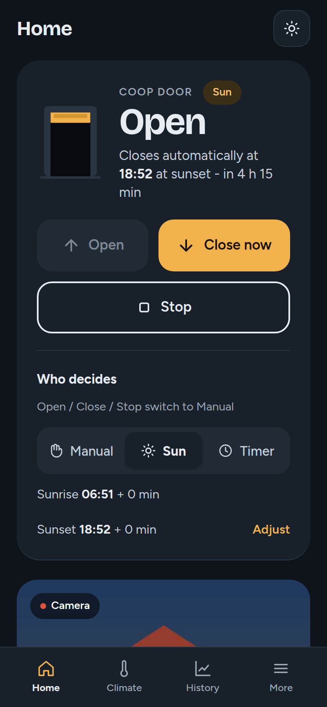

# Dinky Coop

*Those chickens won't open the door themselves...*


|                            |
| :----------------------------------------------------------------: |
| *Automatic door powered by linear actuator, video sped up 2.5x.* |

This is the [Raspberry Pi](https://www.raspberrypi.com) based controller software running my chicken coop. It exhibits the following capabilities:

1. Automatic open and closing of coop door based on sunrise and sunset time (and configurable offset)
2. Open and closing of the coop door via an external 3 position switch
3. Temperature and humidity sensing inside and outside the coop
4. Logging of all data to CSV files
5. A simple [Flask](https://flask.palletsprojects.com/en) web app to view temperature and humidity and command the door

## The Web App

The web app shows the door, the climate in and around the coop, the camera and
the history of the day. On a PC it has a sidebar; on a phone a tab bar. It
follows the system's light or dark mode (or pick one under *System & updates*),
and can be installed to the home screen as an app.




| Page | What you can do there |
|------|-----------------------|
| **Home** | See and move the door (Open / Stop / Close), choose who decides (Manual, Sun, Timer), camera, temperatures, today's events |
| **Climate** | Coop, outside and controller temperatures with today's chart |
| **History** | Charts of any logged day with door open/closed bands, recent door events |
| **Camera** | Live picture, fullscreen |
| **Schedule & location** | Mode, sunrise/sunset offsets, fixed times, city search or coordinates |
| **Network** | Wi-Fi status, scan, save and connect; fallback hotspot |
| **Door & hardware** | Calibration, test error, live GPIO pins, pin configuration, door simulator (mock hardware) |
| **Logs** | Search and filter the log files by level and component |
| **System & updates** | Device health, clock, update, restart, theme, push notifications |

Problems show up as banners on every page with a button that fixes them
(calibrate, clear error, set the clock, …).

## How it is Wired Up

This is how things are connected, drawn using [Fritzing](https://fritzing.org/).


## How to Install

On your Raspberry Pi, run the following:

```
$ git clone https://github.com/dinkelk/coop.git
$ cd coop
$ python3 -m venv venv
$ source venv/bin/activate
$ pip install --upgrade pip
$ pip install -r requirements.txt
$ python3 src/app.py
```

Now access the webserver with a browser at http://127.0.0.1:5000.

### Trying it without a Raspberry Pi

The controller runs on any computer with simulated hardware (virtual door,
sensors and camera):

```
$ echo "use_mock_hardware: true" > config.yaml
$ python3 src/app.py
```

Open http://127.0.0.1:5000, press **Calibrate now** and watch the simulated
door move. *Door & hardware* has a simulator panel to hold the manual switch
and press the endstops by hand. `simulator_travel_s: 3` in `config.yaml`
makes the simulated door faster.

### Command line

Run these from the `src/` directory:

| Command | Purpose |
|---------|---------|
| `python -m coop` | run the controller (same as `python src/app.py`) |
| `python -m coop set-password` | protect the web interface with HTTP Basic auth |
| `python -m coop disable-auth` | remove the web password |
| `python -m coop check-config` | validate `config.yaml` |

### Development

```
$ pip install -r requirements.txt -r requirements-dev.txt
$ pytest                  # unit tests + browser end-to-end tests
$ pytest -m "not e2e"     # unit tests only (a few seconds)
```

The end-to-end tests (`tests/e2e/`) start the real server on mock hardware
and click through every page in headless Chromium. They need
`playwright install chromium` once (or set `COOP_E2E_CHROMIUM` to a Chromium
binary) and are skipped when Playwright is not installed.

See [overview.md](overview.md) for the architecture of the `src/coop` package.

**Note:** Sometimes it is necessary to reset CircuitPython after encountering errors like `Unable to set line 21 to input` by running:

```
$ killall libgpiod_pulsein64
```

## Run Automatically at Startup

### Option A — systemd service (recommended)

Running as a systemd service gives you automatic restart on failure and proper integration with the built-in **Update** button in the web UI.

1. Create the service file:

```bash
sudo nano /etc/systemd/system/chicken.service
```

2. Paste the following content:

```ini
[Unit]
Description=Coop / Chicken Door Application
After=network.target

[Service]
User=pi
WorkingDirectory=/home/pi/coopDoorPython/
ExecStart=/home/pi/coopDoorPython/venv/bin/python /home/pi/coopDoorPython/src/app.py
Restart=on-failure
KillMode=process

[Install]
WantedBy=multi-user.target
```

> **Note:** `KillMode=process` is required so that the update helper script (`update_script.py`) is not killed by systemd when the main process exits during an update. Without it the app will not restart after clicking the Update button.

3. Enable and start the service:

```bash
sudo systemctl daemon-reload
sudo systemctl enable chicken
sudo systemctl start chicken
```

4. Check that it is running:

```bash
sudo systemctl status chicken
```

**Useful commands:**

| Action | Command |
|--------|---------|
| View live logs | `journalctl -u chicken -f` |
| Stop the service | `sudo systemctl stop chicken` |
| Restart the service | `sudo systemctl restart chicken` |
| Disable auto-start | `sudo systemctl disable chicken` |

### Option B — cron (legacy)

To start the controller automatically at boot via cron, run `crontab -e` and append the following entry:

```
@reboot /home/pi/coopDoorPython/cron_script.sh
```

> **Note:** The Update button in the web UI does **not** work reliably with this option because cron does not restart the process after an update. Use the systemd service (Option A) if you need the Update button to work.

## Network Monitoring

My Raspberry Pi is on a flaky network connection and sometimes it is necessary to periodically reset the Wi-Fi. A script is included to monitor the connection and reset it if necessary. To install this script run `sudo crontab -e` and append the following entry.

```
@reboot /home/pi/coop/check_network.sh 8.8.8.8
```

Replace `8.8.8.8` with the IP address of your router if you just want to check local network connectivity.

## Push Notifications

Door errors and blocked schedule moves are sent as Web Push notifications.
Create the VAPID keys once with `python3 src/generateVapidPair.py`; they are
stored in `.secrets.yaml` in the repository root.

Sidenote:

If you encounter any issues when booting up the App regarding

`RPi.GPIO RuntimeError: Failed to add edge detection` More Information [here](https://raspberrypi.stackexchange.com/questions/147332/rpi-gpio-runtimeerror-failed-to-add-edge-detection)

You may want to deinstall `RPi.GPIO` and install `rpi-lgpio` instead with

````
pip uninstall RPi.GPIO
pip install rpi-lgpio
````

