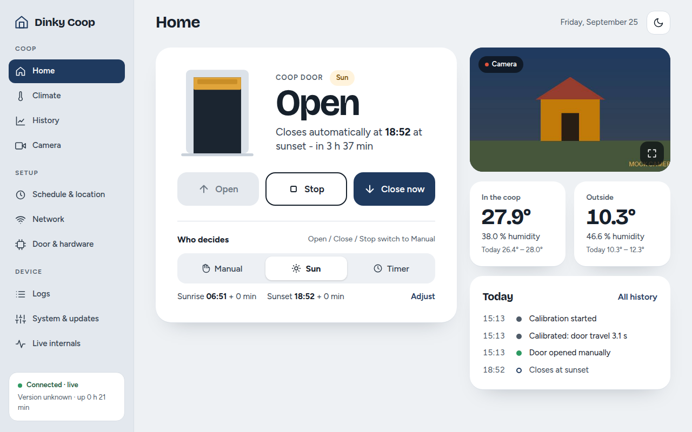
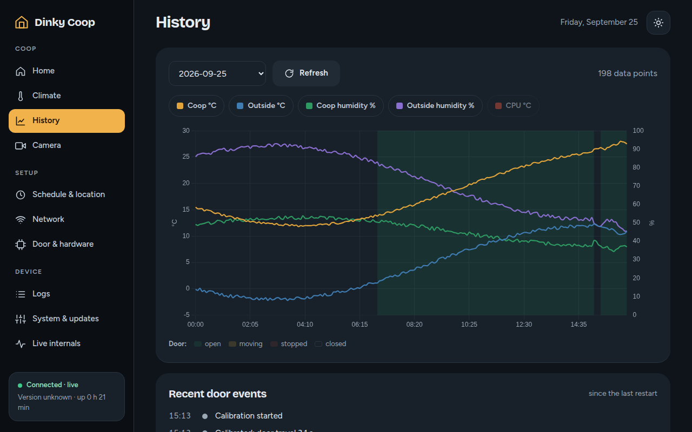
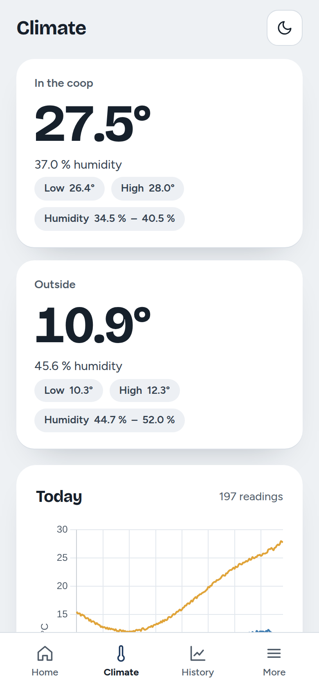
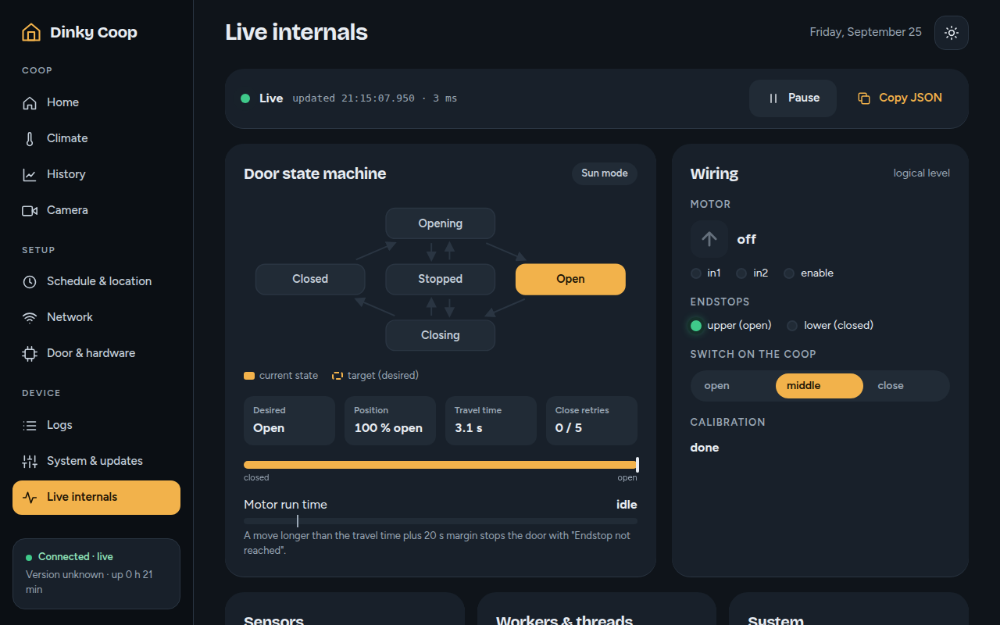

# Dinky Coop

*Those chickens won't open the door themselves...* A Raspberry Pi controller
that opens and closes the chicken-coop door, watches the climate and shows it
all in a web app.



| History (dark) | Phone | Phone (dark) |
| :-: | :-: | :-: |
|  |  |  |

## Features

**Door**
- Open / Stop / Close from the app
- Modes: **Manual**, **Sun** (sunrise/sunset + offsets), **Timer** (fixed times, overnight allowed)
- Physical 3-position override switch on the coop
- One-time calibration measures the travel time
- Safety stop if an endstop isn't reached in time
- Blocked-door detection with automatic close retries
- Test error button

**Monitoring**
- Coop and outside temperature/humidity (DHT11 inside; DHT22 or Open-Meteo outside), CPU temperature
- Daily CSV logging
- History charts per day with door open/closed bands
- Today's door events
- Live webcam view

**Setup pages**
- Schedule & location: city search, coordinates or *Use my location*
- Network: Wi-Fi scan/save/connect, fallback hotspot with captive portal
- Door & hardware: calibration, live GPIO pins, pin configuration, door simulator (mock hardware)
- Logs: viewer with search, level and component filters
- System & updates: service health, set clock, reboot, theme, push notifications
- One-click updates; switch between **Stable** (`main`) and any **Dev** branch
- Live internals: state machine, wiring LEDs, timers, workers, all settings - live

**App**
- Desktop and phone (sidebar / tab bar), light & dark mode, installable PWA
- Push notifications for door problems
- Banners that say what's wrong, with a one-click fix
- Optional web password (HTTP Basic)

**Development**
- Runs on any computer with simulated hardware (mock mode)
- Unit tests + browser end-to-end tests

## Quick start

```bash
git clone https://github.com/windowslucker1121/coopDoorPython.git && cd coopDoorPython
python3 -m venv venv && source venv/bin/activate
pip install -r requirements.txt
echo "use_mock_hardware: true" > config.yaml   # only to try it without a Pi
python3 src/app.py                             # then open http://127.0.0.1:5000
```

Parts, wiring, running as a service and configuration: **[docs/SETUP.md](docs/SETUP.md)**.



## Development

```bash
pip install -r requirements-dev.txt
pytest                 # everything
pytest -m "not e2e"    # unit tests only
```

End-to-end tests need Playwright + Chromium (`playwright install chromium`).
Architecture: [overview.md](overview.md).

## License

MIT - see [LICENSE](LICENSE).
